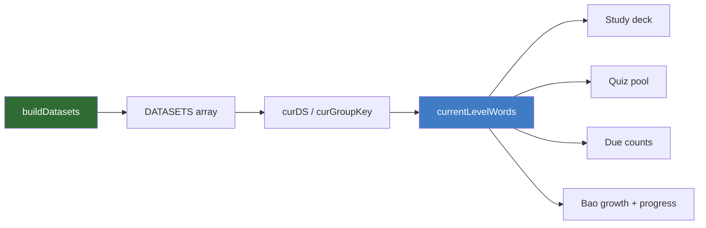
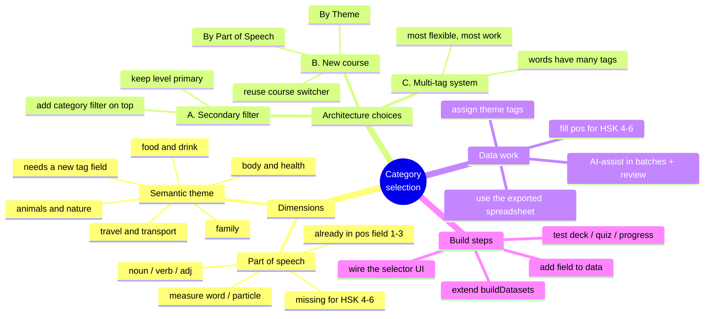
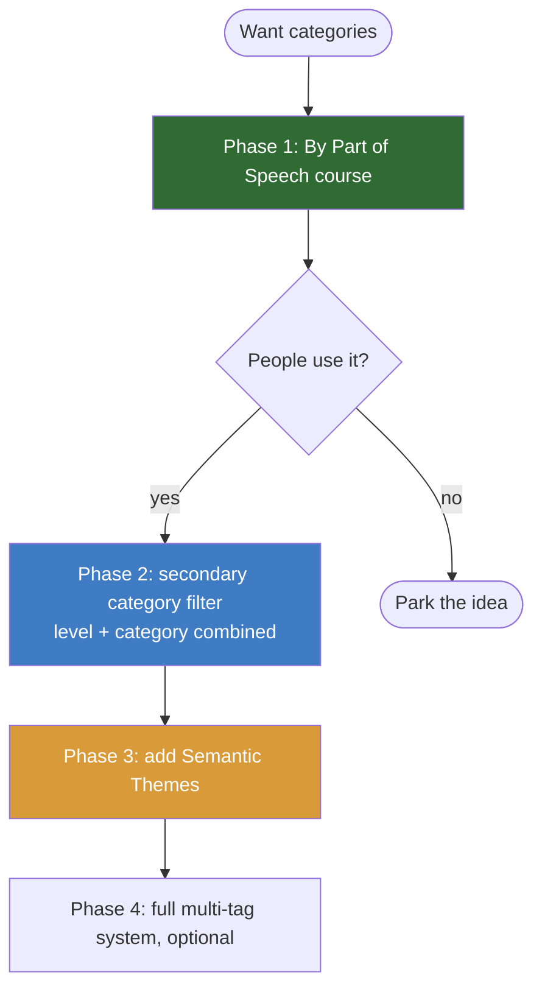

# 🐼 Panda HSK — Category Expansion Roadmap

*A structural note so you don't lose the thread. Covers the idea (item 4) and a step-by-step playbook (item 5) for letting learners browse vocabulary by **category** (part-of-speech and/or theme) in addition to **HSK level**.*

---

## 1. The goal in one sentence

> Today a learner picks **HSK 1–6** (or a class lesson) and studies that slice. You want them to *also* be able to pick a **category** — grammatical (noun / verb / adjective…) or thematic (family / food / travel / animals…) — and study that slice instead, or on top of the level.

There are **two different kinds of "category"**, and they have very different costs. Keeping them separate in your head is the single most important thing:

| Dimension | Example values | Do you already have the data? | Effort |
|---|---|---|---|
| **Part of speech (POS)** | noun, verb, adjective, measure word… | **Partly** — `pos` exists for HSK 1–3 and lessons; **empty for HSK 4–6** | Low–medium (data-fill) |
| **Semantic theme** | family, food, body, travel, animals… | **No** — no theme field exists yet | Medium–high (tagging) |

---

## 2. How grouping works in the app *today* (so you can reuse it)

Your app is already built around exactly this concept — it just calls it "courses" and "groups." One function is the hub:

```
buildDatasets()   ← index.html, ~line 623
```

It returns an array of **datasets** ("courses"), each shaped like:

```js
{ key:"hsk", name:"HSK 1–6", groupLabel:"Level",
  groups:[ {key:"1",name:"HSK 1",sub:"300 words"}, … ],
  words:[ {id, ds, grp, h, p, pos, e, th, ja}, … ] }
```

The machinery that consumes it:

- **`d.byGroup[key]`** — words pre-bucketed by their `grp`. Built automatically at line ~650.
- **`curGroupKey()`** — which group is selected (saved per-dataset in `settings.groups`).
- **`currentLevelWords()`** (line ~852) — returns the words for the active group; **everything** (study deck, quiz pool, due counts) flows from this one function.

**Why this matters:** you do **not** need to rebuild the study/quiz/progress engine. If you can produce a new dataset (or a new grouping) whose words flow through `currentLevelWords()`, the whole app "just works" — flashcards, SRS, quizzes, Bao's growth, all of it. This is the same hinge you used to add the Class Lessons course.



---

## 3. The whole idea, as a mindmap



---

## 4. Three ways to build it (pick a lane)

### Option A — Category as a *secondary filter* (level stays primary)
Keep the HSK-level dropdown, and add a second control (chips or a dropdown) that further narrows the current level by category. "HSK 3 → verbs."
- ✅ Most faithful to how people actually study; composable.
- ⚠️ New UI + you must thread a second filter through `currentLevelWords()`.

### Option B — Category as its *own course* ⭐ recommended first step
Add a new dataset in `buildDatasets()` — e.g. **"By Part of Speech"** whose `groups` are noun/verb/adj… built by scanning `ALL_WORDS`. Users switch to it from the **same course selector** you already have.
- ✅ **Lowest risk** — reuses the exact pattern you used for Class Lessons. No new UI paradigm.
- ✅ Ships value immediately for POS (data already exists for 1–3 + lessons).
- ⚠️ It's a *separate* view, not "HSK 3 verbs only" — level and category aren't combined.

### Option C — Full tag system (each word has many tags)
Give every word a `tags:[]` array and build a proper multi-select filter.
- ✅ Most powerful and future-proof.
- ⚠️ Most data + UI work; do this only once A or B proves the demand.

**Recommendation:** **B → A → C.** Ship "By Part of Speech" as a course (B) to validate the idea cheaply, then add the combined secondary filter (A) once you've seen people use it, and only reach for C if you truly need many overlapping tags.



---

## 5. Data model — the one change that unlocks everything

Each word object today is `{h, p, pos, e, th, ja}` (plus `id, ds, grp` added at build time). Add **one optional field**:

```js
{ h:"妈妈", p:"māma", pos:"noun", e:"mom", th:"…", ja:"…",
  cat:["family","people"] }      // ← new: an array of theme tags
```

- **POS** needs no new field — it's already `pos`. You just need to (optionally) fill it for HSK 4–6.
- **Themes** need the new `cat` array. Empty/absent = "untagged" (the app should treat untagged gracefully, exactly like it treats empty Thai/Japanese today).

Keep it backward-compatible: a word with no `cat` simply won't appear under any theme. No migration needed.

---

## 6. Per-item playbook (item 5) — steps, tools, watch-outs

### 🅰 Part-of-speech categories

**Steps**
1. Decide your POS buckets. Your data has messy values like `"verb/noun"`, `"noun/(verb)"`, `"classifier"`. **Normalize** them to a small fixed set (noun, verb, adjective, adverb, pronoun, number, measure word, particle, other).
2. In `buildDatasets()`, add a dataset: scan `ALL_WORDS`, map each `pos` string to a bucket, group by bucket.
3. (Optional) Fill `pos` for HSK 4–6 so the buckets are complete.

**Tools**
- The **exported spreadsheet** (`panda-hsk-vocabulary.xlsx`) is your workspace — sort by the *Part of Speech* column to see the mess, add a clean `POS Bucket` column.
- AI (me) can normalize 6,100 POS strings in **reviewable batches**, or guess POS for the HSK 4–6 blanks.

**Watch-outs**
- One word can be two parts of speech (`verb/noun`). Decide: pick the primary, or let it appear in both buckets.
- Don't block the feature on filling all 2,500 HSK-6 blanks — ship with what you have and label untagged words "other."

### 🅱 Semantic theme categories

**Steps**
1. Define a **starter set of themes** (10–15 is plenty: family, food & drink, body & health, time & dates, travel, animals & nature, home, work & study, money & shopping, feelings, verbs of motion…).
2. Tag words into themes. Start small — tag **HSK 1–2 first** (500 words) to prove the flow before scaling.
3. Add a `cat` column to the spreadsheet, re-import into the data, group by theme in `buildDatasets()`.

**Tools**
- Spreadsheet column `Theme(s)` (comma-separated).
- AI-assisted tagging **in batches of ~200–300**, then you spot-check — themes are subjective, so review matters more than for POS.

**Watch-outs**
- Many words fit several themes (爱 = feelings + verbs). Use the **array** `cat`, not a single value.
- Don't aim for 100% coverage on day one. A theme view with 60% of words tagged is already useful; "untagged" is fine.
- Beware over-fine themes — too many tiny buckets is worse than a few good ones.

### 🎛 The selector UI

**Steps (Option B, recommended first)**
- Reuse the **course switcher**: the new POS/Theme datasets appear alongside HSK and Class Lessons. **Near-zero new UI.**

**Steps (Option A, the combined filter, later)**
- Add a row of **category chips** under the level dropdown (mirror the Browse tab's status-filter chips — that pattern already exists at `#statusFilter`).
- Thread the selected category into `currentLevelWords()` as an extra `.filter(...)`.
- Persist the choice in `settings` (like `settings.groups`).

**Watch-outs**
- Save the category choice per dataset, or switching courses will feel like it "forgot."
- Keep the empty state friendly: "No verbs in HSK 1 yet" beats a blank deck.

---

## 7. The smallest next step (if you want momentum today)

1. Open `panda-hsk-vocabulary.xlsx`.
2. Add one column: **`POS Bucket`**. Ask me to fill it (normalize the existing `pos`, guess the HSK 4–6 blanks) in batches you can eyeball.
3. I wire a **"By Part of Speech"** course into `buildDatasets()`.
4. You see categories working end-to-end — with **zero** risk to the level-based flow — and *then* decide whether themes and the combined filter are worth it.

That's Option B, Phase 1: highest learning, lowest risk.

---

## 8. Risk & gotcha checklist

- [ ] **Don't fork the data file.** `index.html` is the live source; `vocab-data.js` is an unused mirror. Tag in the spreadsheet → regenerate → re-inject, so the two never drift.
- [ ] **Card IDs stay namespaced.** New views must reuse the same `hsk:<lv>-<i>` IDs so a word's SRS progress is shared across "HSK 3" and "verbs" views (a word is the same word). If you mint new IDs per view, progress will silently split.
- [ ] **Empty/untagged is normal** — mirror how empty Thai/Japanese is already handled.
- [ ] **Normalize before grouping** — raw `pos` strings will create dozens of junk buckets otherwise.
- [ ] **Test the four flows** after any change: study deck, quiz pool, due counts, Bao/progress — all hang off `currentLevelWords()`.
- [ ] **Theme tagging is subjective** — budget review time; AI gives you a fast first pass, not the final word.

---

*Generated as a planning companion for the Panda HSK project. Keep it in the repo next to the README so future-you (and any collaborator) can pick up the thread.*
